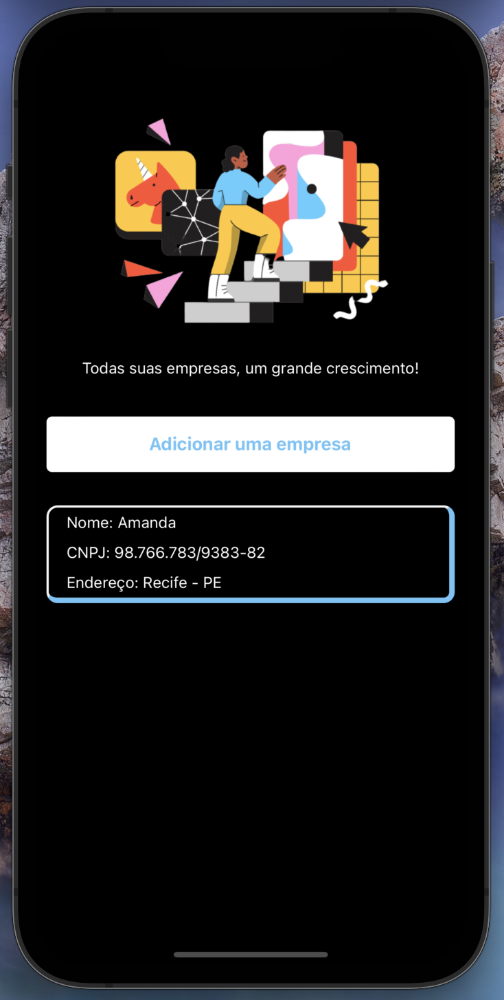
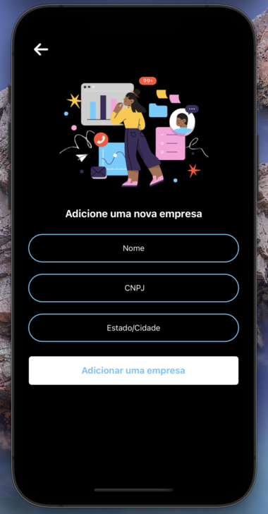

# app-company

## Tecnologias usadas

   

O aplicativo consiste em um CRUD de emprsas, tendo as seguintes funcionalidades: crete, update, delete and list.

  

# Instalação

## Android

```bash
npm install
npx react-native run-android
```

## iOS

```bash
yarn install
cd ios
pod install
cd ..
npx react-native run-ios
```